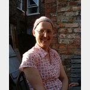
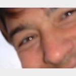
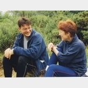

## Cindy Tarrant

{: .alignright} Cindy was born in Emsworth and brought up in Bosham. She studied Home
Economics at Surrey University and went on to do a PGCE in Bath. She
worked for a couple of years at Sarah Bonnell School in east London,
before deciding to stop working for a while and travel the world. She
travelled across Nepal and China and lived and worked in Australia for
18 months. On her way back to Britain she met Edward in Beijing.

## Edward Andrews

{: .alignleft} Edward was born and brought up in St Albans. After not finishing an
electronics degree and doing some voluntary work, he decided that
travelling the world was an interesting option. He went on a double
decker bus from London to Kathmandu, and while in China met Cindy in
Beijing.

## Edward &amp; Cindy

{: .alignright} After meeting in Beijing and travelling home together on the
Trans-Siberian Express, they got it together romantically after a couple
of months in Britain. They travelled together in Thailand and Indonesia,
lived and worked in Australia and came back to the UK in the summer of 1990. Cindy worked in schools in Norton and then in Leeds, while Edward
went to university and then looked after their children - Toby, John and
Rose. Later, Edward did a primary PGCE and started working as a primary
teacher.

Cindy was first diagnosed with lung cancer in the autumn of 1997. She
had had a couple of years of chest problems, including two bouts of
pneumonia, and had been diagnosed as possibly having asthma. She was
having tests for an inflamed area in her lung that produced a shadow on
her chest x-rays.

When she was finally diagnosed as having cancer - adenoid cystic
carcinoma, an unusual type of cancer, that even more unusually had its
primary site in Cindy\'s left lung. After a biopsy was taken, surgery
followed very quickly. She had the biopsy and diagnosis at Castle Hill
Hospital in Hull. She went for the results of the tests on one day, was
kept in and had the surgery the next day - the whole of her left lung
was removed. She spent one night in intensive cared and stayed in
hospital for a fortnight. She came home and recovered amazingly quickly
(although, looking back, she should have had longer off work!). By
January she was back to work part-time, in spite of being on
radiotherapy, and before Easter was working full-time again.

She then went on to have 5 healthy years, doing an incredible amount
considering she only had one lung! She did hill-walking, cycling,
full-time work, looking after her family and generally lived life to the
full.

She continued to have x-rays to check that she was doing ok and
unfortunately, in January 2003, one of these showed several tumours in
her remaining lung. She was recommended to have chemotherapy. She
started an 18 week course of chemo in February 2003. She had a central
line put into her chest, with one set of drugs being pumped in
constantly, and went into hospital every three weeks to have another two
drugs dripped in (for details of her treatment see here). Even as she
started this treatment, we knew that it would not be a cure, but would
shrink the tumours, to give her a better quality of life.

The chemo was hard going but she got through it, and by the summer
holiday she was feeling much better. Over the summer we visited lots of
people, and spent three weeks in the Lake District. While we were in the
Lakes, Cindy climbed Helvellyn and several other large hills!

Cindy went on to have two more courses of chemotherapy and got
progressively worse, more and more short of breath. She died on the 11th
September 2005.
